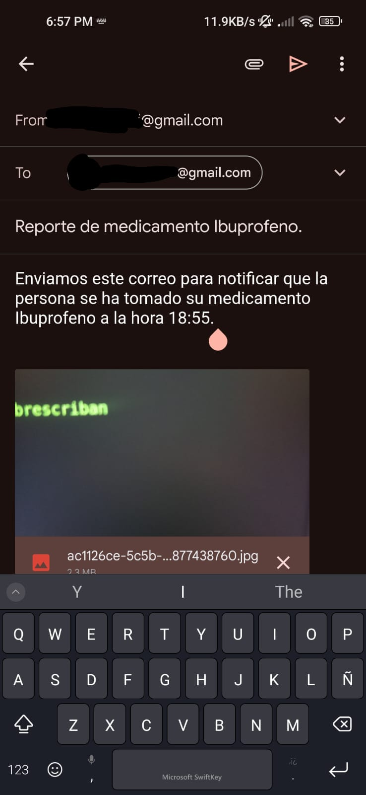
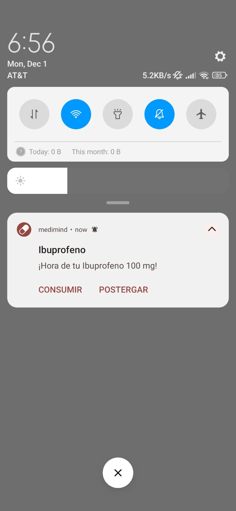
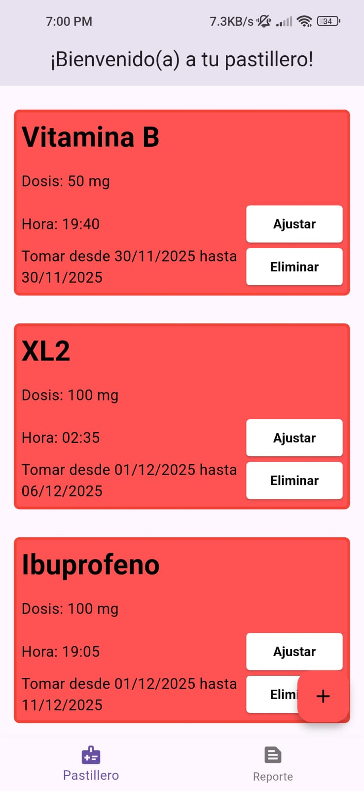
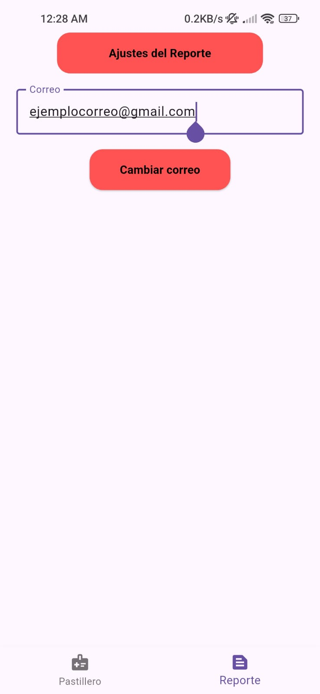

# Medimind

Una aplicación para controlar la administración de los medicamentos de una persona mayor a través de recordatorios y envio
de evidencias mediante correo eléctronico.

## Plugins

- Flutter local notifications
- Image picker
- Flutter email sender

## Funcionalidad

La persona mayor puede agregar sus medicamentos en la pantalla de Pastillero en la cual se va a programar una notificación diaria en el lapso de tiempo entre la fecha de inicio y la fecha final del medicamento. Una vez llegue la hora en la cual debe ingerir el medicamento va a salir una notificación con la opción de Consumir o Postergar en la cual debera tomar una foto, una vez aceptada sera redirigida a su aplicación de correo elećtronico con los datos del medicamento, la foto y el correo del familiar ya cargados, listos para ser enviados al correo de la persona encargada de su atención. Es posible ajustar la fecha y hora final de un medicamento previamente guardado.

El correo de la persona encargada de la atención de la persona mayor puede ser actualizado en la pantalla Reporte para recibir los correos eléctronicos con la evidencia del consumo del medicamento en su tiempo y fecha.

